# 面向前端的 Lottie & AE 动画手把手入门教学
因为我一直比较关注 Web 领域的设计趋势, 很早之前就听很说了 Lottie 这个项目, 但是一直没时间和机会去尝试, 最近终于有时间机会于是尝试了一把, 在这里分享一下。

## 一. Intro to Lottie
Lottie 是 Airbnb 开源的一个支持 Web、Android、iOS 以及 ReactNative等平台的动画库，它可以结合 AE 和 Bodymovin 来快速实现跨平台动画。

其实对于普通的动效和简单动画, 使用原生代码实现已经足够, Lottie 是为了**复杂动画**而生的, 下面来看几个 Lottie 实现的几个动画例子:    
  
这种复杂的动画, 如果需要手写代码来实现, 将会很繁琐且效率低下, 这正是 Lottie 大展身手的地方。
  
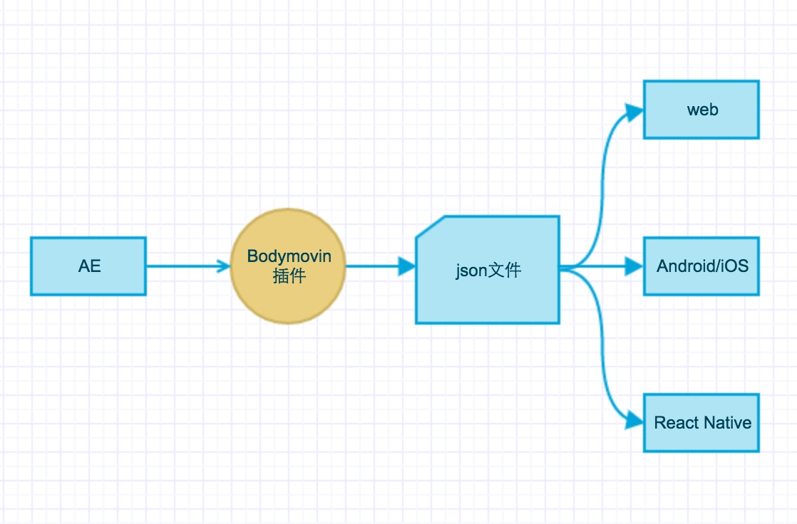
要使用 Lottie, 需要在借助 Bodymovin 插件将动画工程文件从 AE 中导出成 JSON。Lottie 分别为每个平台实现了一套 Player, 只需载入JSON动画文件就可播放。
值得一提的是, Lottie 在 Web 上是借助 Canvas 或者 SVG 来渲染动画的,  动画的关键帧在导出时已经被计算好了, 除了解析JSON之外基本没有性能损耗, 因此**效率非常高**!

## 二. 绘制动画
先 Show 一下完成的效果, 这个动画只需要5分钟便可绘制完成!    
  

首先, 打开 AE, 新建合成, 参数如下:  
  

然后进入AE, 默认会看到这个界面:  
  

每个区域的作用分别是:
* 项目: 管理当前项目以及一些项目参数的预览
* 资源: 导入到 AE 中的所有外部资源如图像等在这里进行统一管理
* 图层: 在这里为每一个图层添加/编辑关键帧和属性
* 时间轴: 在这里可以编辑动画的关键帧和曲线
* 预览: 动画和编辑实时预览/编辑窗口
* 工具: 各种工具的集合, 如文字工具、图形工具等
* 属性: 在这里编辑元素的属性

首先, 选择我们新建的合成, 点击工具栏的圆角矩形按钮, 同时按住shift, 在预览区域绘制一个矩形。   
  
OK, 这里我们的基础图形已经绘制完毕了, 是不是 So easy? 

现在我们需要给其添加关键帧让其动起来。 AE 里的关键帧跟 CSS 里的 keyframe 属性没有什么区别, 我们只需要对其运动过程中的某一些节点添加关键属性, 这个元素将会在相邻两个关键帧之间进行关键属性的平滑变换。

在我们开始之前, 先分析一下动画效果, 可以分成三部分: 
* 位移动画: Y 轴方向的往复运动
* 形状动画: 矩形和圆形之间的往复变换
* 颜色动画: 蓝色和品红色的突变

OK, 让我们先来完成位移动画:
首先, 选中我们的图层, 点击图层左侧三角, 展开变换选项, 选中位置属性, 同时把时间轴移动到0:  
  

这时进行最重要的一步, **添加关键帧**:
首先, 点击图层区域中位置属性左侧的小时钟图标, 开始记录关键帧, 如图:  
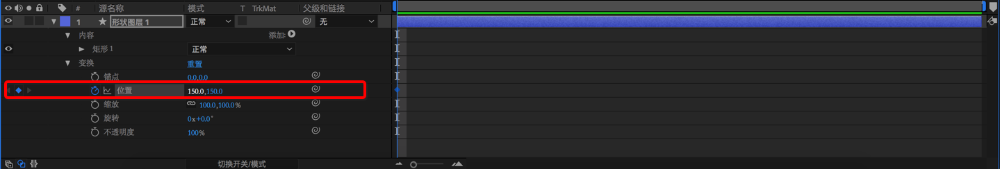  
然后, 将时间轴移到20帧的位置,  点击左侧的菱形激活当前位置的关键帧属性记录, 同时更改位置属性中的Y坐标, 如图:  
  
这么做的意思是: 让图层的Y轴坐标属性, 在0帧到20帧的过程中, 从150动画到380, 是不是很容易理解?
现在按下空格键, 预览效果! BIngo, 你会发现, 矩形动了起来, 虽然只是动了20帧, 但这是我们完成的第一个关键帧动画! 鼓励一下自己~
然后如法炮制, 完成余下的几个关键帧的记录, 如图:  
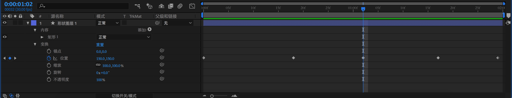    
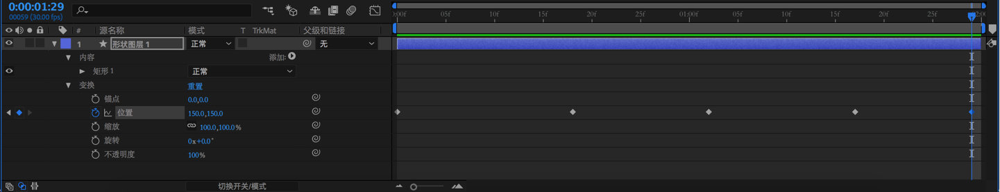  

OK, 现在我们已经添加完了所有的位移关键帧, 按空格再次预览, 如图:  
  
这时, 因为我们的动画都是匀速运动, 看起来会很生硬, 因为真实世界中物理运动是有加速度的。 我们把矩形看作是自由落体后再次反弹, 因此在Y轴坐标最低点和最高点速度应该为0, 整个下降过程是匀加速运动, 上升过程是匀减速运动。 因此我们需要给我们的动画设置曲线, 让其符合真实世界的物理规律。

点击图层面板的右上角, 显示曲线面板, 如图:  
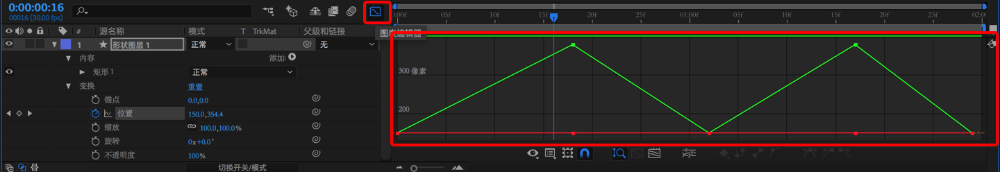  
曲线面板的X轴是时间, Y轴是属性值, 最低点为0, 最高点为设置的最大值, 曲线的便是属性的变化, 曲线的斜率便是加速度的值。

按住ctrl同时点击选择我们的动画路径, 点击右下角的转换为贝塞尔曲线按钮。  
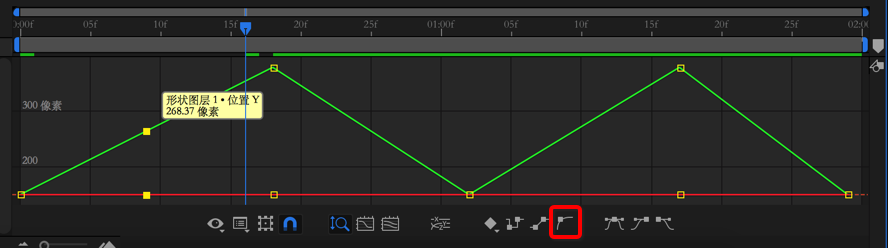  
但是这时什么都不会发生。。。
因为目前的位移属性实际上是集合和X轴位移和Y轴位移两个属性的, 从曲线也能反映出来, 下面那条平行于X轴的直线表示X轴位移。我们无法同时为两个属性设置曲线, 需要将X和Y方向的位移属性分开, 右键点击图层面板的位置属性, 选择选择单独尺寸, 然后我们就可以单独为Y方向的位移属性设置曲线了, 如图:  
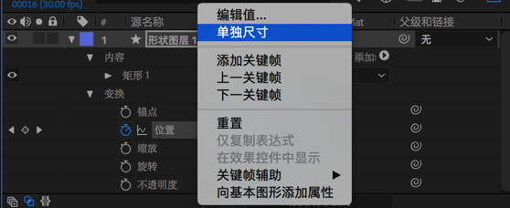  
选中Y方向的位移属性曲线, 点击转换为贝塞尔曲线。这时曲线的每一个拐点将会多出一个锚点和两个方向的控制器, 曲线将会与其中一个控制器相切, 并且曲线与控制器相切处的半径等于控制器的长度。 因此我们只需要拖动控制器便可以控制曲线。  
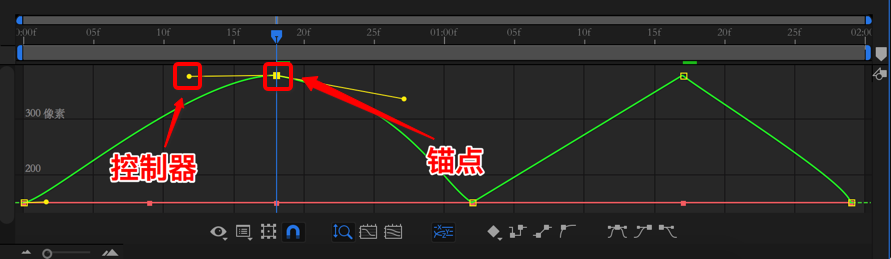  
同时, 点击工具栏中的钢笔工具, 便可以在曲线任意位置额外添加锚点进行更进一步的曲线控制。
按住 ALT 同时点击点击锚点可以将之前转换为曲线。
另外, 按住 Command/CTRL 的同时可以直接拖动曲线中的锚点。

我们编辑完的第一条曲线是这样的:  
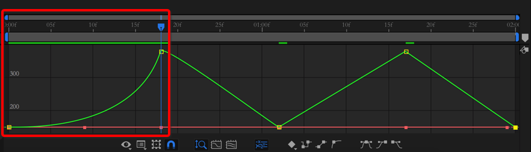  
为了达到速度突变的效果, 所以我们在这里把时间轴往后移动1帧或者2帧(让变换的时间很短, 肉眼看不出过程, 就是突变啦~), 再调整曲线, 如图:  
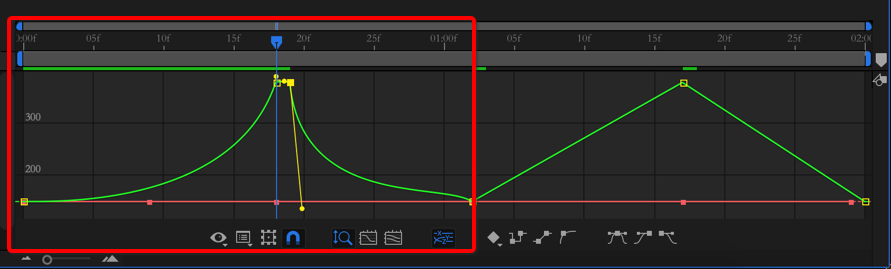  
重复之前的步骤编辑剩下的几个关键帧曲线, 最后, 编辑完的曲线如图:  
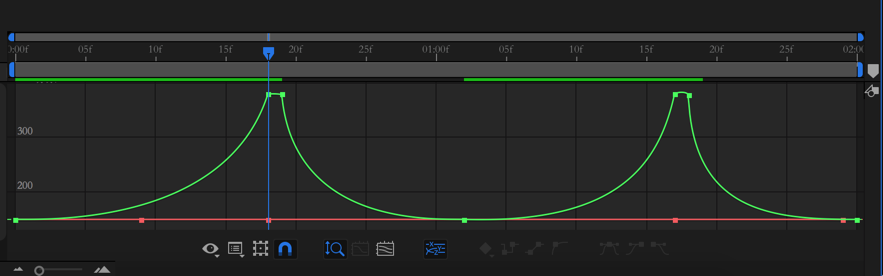  
按空格键预览, 如图:  
  
Yooooo! 比刚刚自然多了!

让我们进行下一步, 添加形状变换的关键帧。
首先, 点击图层左侧三角, 展开变换选项, 依次展开: 内容、矩形、矩形路径。将时间轴移到0, 圆度属性设置为0, 点击圆度左侧的时钟小图标, 开始纪录该属性关键帧。  
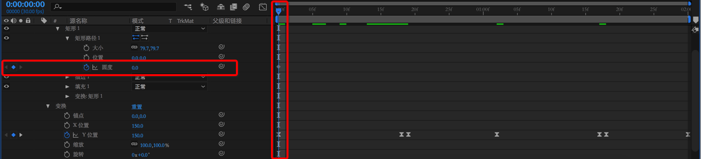  
然后将时间轴移到下一次Y轴坐标的最低点, 与位移动画的第二个关键帧对齐, 点击圆度属性左侧的菱形激活当前圆度的关键帧属性记录。  
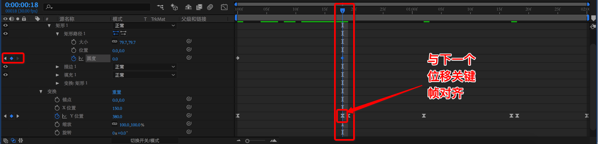  
将时间轴移到下一个关键帧, 也就是速度第一次突变后的关键帧, 再次点击圆度属性左侧的菱形纪录关键帧, 同时把圆度属性设为100%。便完成了矩形到圆形的突变动画。  
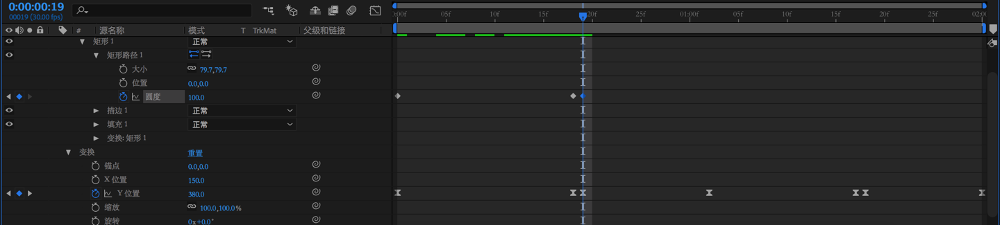  
重复上述步骤, 将时间轴移到圆形下一次运动到Y轴的最低点, 再次添加关键帧让圆形变换成矩形, 最终的关键帧曲线如图:  
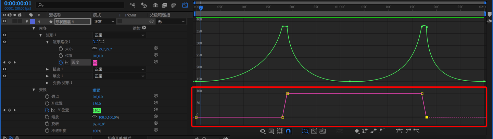  
预览一下效果:  
  

现在进行最后一步, 颜色变换。颜色属性在图层面板的内容、矩形、填充里更改, 其他地方跟上述一样, 无非是再次添加几个关键帧。相信聪明的你一点已经学会了, 这里就不再赘述啦。
最终的曲线如图:  
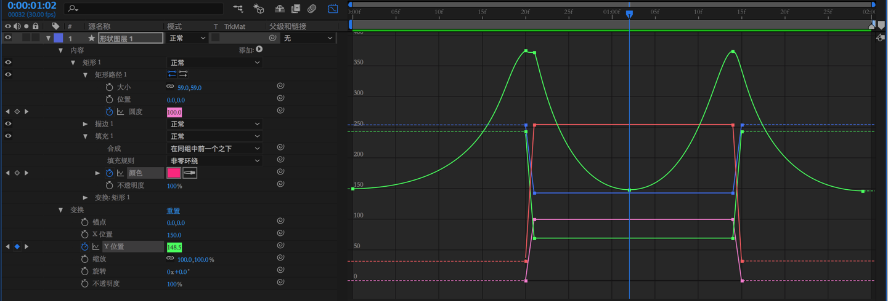  
最终完成效果:    
    
Yooooooooooooooooooo! 是不是感觉自己很厉害~ 

## 三. 渲染动画
现在动画的绘制工作已经完成, 我们可以导出我们的动画了。首先需要在 AE 里安装 Bodymovin，参考  [GitHub - airbnb/lottie-web: Render After Effects animations natively on Web, Android and iOS, and React Native. http://airbnb.io/lottie/](https://github.com/airbnb/lottie-web)

安装后选择该插件:  
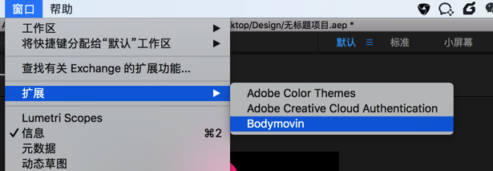  
安装后选择我们的合成和导出路径, 点击 Render:  
  

导出文件后, 新建一个项目, 把 data.json 移到项目目录, 安装所需依赖。
这里我们使用 Lottie 的 React Binding, 运行 `npm install -S react react-dom react-lottie babel-core babel-plugin-transform-class-properties parcel-bundler`。
新建 index.html:
```html
<body>
    <div id="root"></div>
    <script src="./index.js"></script>
</body>
```
新建 index.js:
```js
import React from 'react';
import ReactDOM from 'react-dom';
import Lottie from 'react-lottie';
import * as animationData from './data.json'

class App extends React.Component {
  state = {
    isStopped: false,
    isPaused: false
  };

  defaultOptions = {
    loop: true,
    autoplay: true,
    animationData: animationData,
    renderer: 'canvas'
  };

  play = () => this.setState({isStopped: false, isPaused: false});
  stop = () => this.setState({isStopped: true});
  pause = () => this.setState({isPaused: !this.state.isPaused});

  render() {
    const buttonStyle = {
      display: 'block',
      margin: '10px auto'
    };

    return <div>
      <Lottie
        options={this.defaultOptions}
        width={600}
        isStopped={this.state.isStopped}
        isPaused={this.state.isPaused}
      />
      <button style={buttonStyle} onClick={this.stop}>停止</button>
      <button style={buttonStyle} onClick={this.play}>播放</button>
      <button style={buttonStyle} onClick={this.pause}>暂停</button>
    </div>
  }
}

ReactDOM.render(<App/>, document.getElementById('root'));
```
然后运行`parcel ./index.html`, 打开浏览器, 将会看到我们的动画, 是不是非常酷~ 

除了能够播放和暂停, Lottie 还为我们提供了更加精细的动画控制方法和事件钩子, 有兴趣的小伙伴参考: [GitHub - airbnb/lottie-web: Render After Effects animations natively on Web, Android and iOS, and React Native. http://airbnb.io/lottie/](https://github.com/airbnb/lottie-web)
本教程的所有源码和AE工程文件都在我的 GitHub: [HuQingyang (胡青杨) · GitHub](https://github.com/HuQingyang) 欢迎关注、交流、拍砖、~~搞基~~
